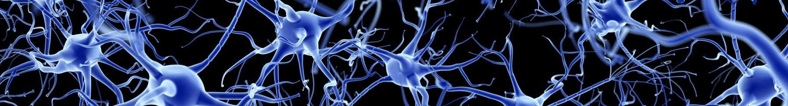
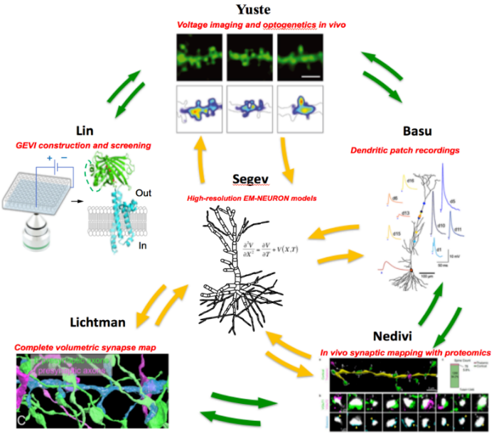

# Dendritic Consortium Multimodal Dataset  
### Neurons in Mouse Primary Visual Cortex (V1) and Hydra vulgaris nerve net



## Summary
This dataset provides a comprehensive collection of multimodal data resulting from the collaboration of six leading neuroscience laboratories, collectively known as the Dendritic Consortium. The data integrates various high-resolution modalities, including in vivo calcium and voltage imaging, dendritic patch-clamp recordings, synaptic mapping, proteomics, volumetric EM-based maps, and computational neuronal models. These datasets are derived from research on Baz1a pyramidal neurons in the mouse primary visual cortex (V1) and endoderm neurons of *Hydra vulgaris*. The data is publicly available to foster collaboration and accelerate neuroscience research.

## About
The Dendritic Consortium dataset challenges the conventional model of neurons by emphasizing dendrites as active computational units, rather than passive structures. This approach is supported by a multidisciplinary combination of molecular, structural, functional, and computational data, collected using advanced neuroscience techniques. The project brings together six prestigious research laboratories: Michael Lin's lab at Stanford University, Rafael Yuste's lab at Columbia University, Jayeeta Basu's lab at New York University, Elly Nedivi's lab at MIT, Jeff Lichtman's lab at Harvard University, and Idan Segev's lab at the Hebrew University of Jerusalem. Together, they aim to expand our understanding of dendritic function and its role in neuronal processing.

## Data

#### Overview

To fully understand dendritic function, it's essential to gather multimodal data from various experimental and computational approaches. This dataset includes calcium and voltage imaging, electrophysiology data, synaptic mapping, proteomics, volumetric electron microscopy-based maps, and computational models. These diverse techniques provide a comprehensive view of neural function across two species: Mus musculus (focusing on Baz1a pyramidal neurons in the primary visual cortex) and *Hydra vulgaris* (with EM-data from its endodermal neurons). The dataset is available in multiple file formats, including TIFF, HDF5, GBK, ABF, PNG, PY, MAT, CSV, JSON, HOC, PKL, and ASC/SWC.

<p align="center">
  
</p>

#### Update Cadence
This dataset is continuously expanding, as the participating laboratories within the Dendritic Consortium regularly generate new experimental and computational data. As a result, the dataset is constantly updated.

#### Data Available
The dataset contains multimodal files capturing:

| Data Modality            | Description                                                                  | Format                                          |
|--------------------------|------------------------------------------------------------------------------|-------------------------------------------------|
| Voltage imaging files    | High temporal resolution optical voltage recordings.                         | TIFF                                            |
| Calcium imaging files    | Optical recordings capturing calcium dynamics.                               | TIFF, PNG                                       |
| Electrophysiology data   | Patch-clamp recordings capturing electrical activity.                        | ABF, MAT, CSV                                   |
| Synaptic mapping         | Data related to synaptic connections and interactions.                       | CSV                                             |
| Proteomics               | Protein expression and synaptic marker data.                                 | CSV                                             |
| EM Volumes               | 3D volumetric electron microscopy maps.                                      | TIFF, PNG                                       |
| Computational models     | Neuronal morphologies and simulations.                                       | SWC, HOC, PY, PKL                               |
| Metadata                 | Stored in a database accessible via a GUI. Access details will be announced. | N/A                                             |

## Metadata
The dataset metadata is organized into relational tables that describe various aspects of the data. These tables offer context on data provenance, experimental conditions, parameters, and other relevant information. The metadata will be accessible through an easy-to-use graphical interface. Detailed descriptions of each table's attributes (columns), including types and descriptions, are available in [metadata.md](metadata.md). All JSON schemas are available in the [json-schemas](json-schemas) directory. Below is a summary of the metadata tables included:

| **Table Name**                 | **Description**                                                                           | **Access JSON**                                                         |
|--------------------------------|-------------------------------------------------------------------------------------------|-------------------------------------------------------------------------|
| **analysis**                   | Files generated from computational/statistical analysis (graphs, reports, metrics).       | [analysis.json](json-schemas/analysis.json)                             |
| **behavior**                   | Quantitative/qualitative behavioral data recorded during experiments.                     | [behavior.json](json-schemas/behavior.json)                             |
| **cell_detection_dataset**     | Datasets of detected cell locations/types from segmentation tools.                        | [cell_detection_dataset.json](json-schemas/cell_detection_dataset.json) |
| **ephys**                      | Electrophysiology recordings, e.g., dendritic patch-clamp data.                           | [ephys.json](json-schemas/ephys.json)                                   |
| **image**                      | Imaging files capturing calcium, voltage, or fluorescence signals.                        | [image.json](json-schemas/image.json)                                   |
| **micro_ct_dataset**           | High-resolution micro-CT volumetric anatomical images.                                    | [micro_ct_dataset.json](json-schemas/micro_ct_dataset.json)             |
| **model**                      | Computational neuronal models simulating biophysical properties.                          | [model.json](json-schemas/model.json)                                   |
| **mouse**                      | Mouse specimen metadata including strain, genotype, birth date, etc.                      | [mouse.json](json-schemas/mouse.json)                                   |
| **plasmid**                    | Plasmids used for genetic constructs (e.g., GEVIs, opsins).                               | [plasmid.json](json-schemas/plasmid.json)                               |
| **sem_dataset**                | Scanning electron microscopy datasets with ultrastructural details.                       | [sem_dataset.json](json-schemas/sem_dataset.json)                       |
| **session**                    | Data acquisition events metadata (experimenter, date, anesthesia, etc.).                  | [session.json](json-schemas/session.json)                               |
| **virus**                      | Information on AAV vectors used for genetic delivery.                                     | [virus.json](json-schemas/virus.json)                                   |

## Data Access
The dataset will be publicly available on an [AWS S3](https://aws.amazon.com/s3/) bucket (access details to be announced) with a well-organized directory structure to facilitate easy and scalable access. You can explore the data using the following path:

```
s3://dendritic-consortium/
├── lab-name/             ← Root folder for each participating lab
  ├── YYYYMMDD/           ← Date of the experimental session
    ├── object-type/      ← Data modality or type (e.g., image, ephys, sem_dataset)
      ├── version/        ← Data version (raw, processed, roi, script)
        ├── files/        ← Actual data files
```
Data access is open, and no sign-in is required for downloads. Detailed access instructions and AWS CLI examples will be provided once the dataset is publicly available.

## Tutorials

Step-by-step examples to access, download, and analyze the multimodal dataset on AWS are available in the [/tutorials](tutorials) directory. These tutorials demonstrate how to use both Python and the AWS CLI to interact with the data, including how to retrieve, visualize, and process various modalities such as imaging and electrophysiology recordings.

*This dataset is a collaboration between Columbia University, Stanford University, New York University, Harvard University, MIT, and Hebrew University of Jerusalem.*
